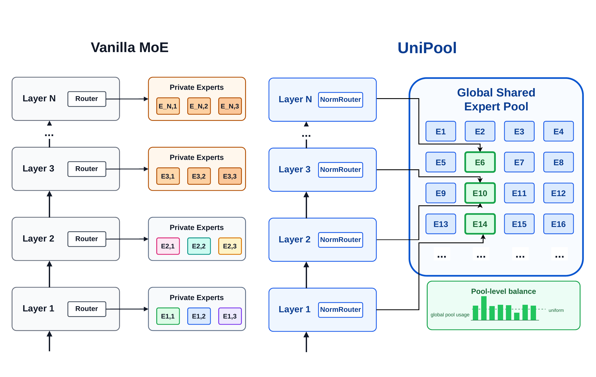

# UniPool



UniPool is a research code release for shared expert-pool Mixture-of-Experts
(MoE) training on top of Megatron-LM/Megatron Core. It adds a mode where MoE
layers keep separate routers while sharing a global or grouped expert pool.

This repository is a derivative of NVIDIA Megatron-LM. The training and
evaluation setup (Pile preprocessing, LLaMA-architecture baselines at the
182M–978M scale) follows the protocol used by
[ReMoE](https://github.com/thu-ml/ReMoE), reusing its data pipeline so
results are directly comparable. The original upstream Megatron README is
preserved as [README_MEGATRON.md](README_MEGATRON.md).

## What is UniPool?

UniPool ("Unified Expert Pool") is a Mixture-of-Experts architecture that
replaces the standard per-layer expert ownership with a single **globally
shared expert pool**. In a vanilla MoE transformer, each of the L layers
maintains its own private set of E expert FFNs, hard-coding a linear
relationship between depth and total expert parameters. UniPool removes this
constraint: all L layers route into one shared pool of M experts, while each
layer keeps its own independent router. Any expert can be selected by any
depth, so capacity is reused across layers instead of duplicated.

Two components make shared-pool training stable:

- **Pool-level auxiliary loss.** Load balancing is computed by aggregating
  token-to-expert assignments over the *whole pool* rather than per layer.
  This prevents globally dead experts without forcing every layer to use
  every expert, which would destroy layer-specific specialization.
- **NormRouter.** An L2-normalize → ReLU gating function with a learnable
  scale, used in place of softmax. It keeps routing scores sparse and
  scale-stable when many per-layer routers compete over the same large pool.

Across five LLaMA-architecture active-parameter scales (182M / 469M / 650M /
830M / 978M) trained on 30B tokens of the Pile, UniPool improves validation
loss over matched vanilla MoE by up to 0.0386, and reduced-pool variants
using only 41.6%–66.7% of the vanilla expert-parameter budget match or
outperform layer-wise MoE — pool size becomes an explicit, sublinear
depth-scaling knob.

## Installation

UniPool shares the same dependency stack as Megatron-LM/Megatron Core. The
recommended route is an NVIDIA PyTorch/NGC container with PyTorch, CUDA,
NCCL, Transformer Engine, and Triton installed; see
[README_MEGATRON.md](README_MEGATRON.md) for the full upstream notes.

From the repository root:

```bash
pip install --no-build-isolation -e ".[mlm,dev]"
```

The distribution package name is `unipool-megatron`. The Python import path
remains `megatron` because this is a Megatron fork.

## Usage

The UniPool routing/expert-pool surface is enabled with these flags (see
`scripts/train_llama_*_moe_UniPool.sh` for full configurations):

- `--moe-expert-pool-mode hyper` — each MoE layer gets its own router while
  sharing a global or grouped expert pool.
- `--moe-expert-pool-size <N>` — group size. Empty means one global pool
  across all layers; positive `N` groups every `N` adjacent layers into one
  pool.
- `--moe-pool-aux-loss-coeff <coeff>` — pool-level load balancing across all
  layers that share a pool.
- `--moe-norm-routing` — NormRouter (default in UniPool scripts).

Core implementation lives in `megatron/core/transformer/moe/{moe_layer,
moe_utils,router}.py` and `megatron/training/{arguments,checkpointing}.py`.

## Reproducing the Results

1. **Data preprocessing.** Download the Pile from
   [`monology/pile-uncopyrighted`](https://huggingface.co/datasets/monology/pile-uncopyrighted)
   and place shards at `../pile/{00..29}.jsonl`, then run:

   ```bash
   bash data_preprocessing.sh
   ```

   This writes Megatron indexed datasets to `../pile_gpt_test/`. The data
   pipeline matches ReMoE's. Override paths via `INPUT_DIR`, `OUTPUT_DIR`,
   `VOCAB_FILE`, `MERGE_FILE` env vars if your layout differs.

2. **Training.** UniPool shared-pool runs:

   ```bash
   bash scripts/train_llama_<size>_moe_UniPool.sh
   #   size in {182m, 469m, 650m, 830m, 978m}
   ```

   Full script signature:

   ```text
   bash scripts/train_llama_<size>_moe_UniPool.sh \
     [gpus_per_node] [train_iters] [micro_batch_size] [num_experts] \
     [norm_routing] [layer_aux_coeff] [pool_aux_coeff] [pool_size] \
     [project_name] [save_interval] [save_retain_interval] [num_layers] [top_k]
   ```

   For 650m / 830m, additional `EP_SIZE` (expert model parallel) and
   `EXIT_DURATION_MIN` (wall-clock save+exit) env vars are available in the
   script headers. Defaults: sequence length 1024, global batch size 512,
   60k iters ≈ 30B tokens.

   Dense and vanilla-MoE baselines under matched configs are also provided
   as `scripts/train_llama_<size>_{dense,moe}.sh`. Outputs land in
   `new_logs/<project_name>` (UniPool / MoE) and `logs/<project_name>`
   (dense). Checkpoints are passed to both `--save` and `--load` so training
   can resume from the same directory.

## Acknowledgments

UniPool builds on top of
[NVIDIA Megatron-LM](https://github.com/NVIDIA/Megatron-LM) and adopts the
experimental setup (data pipeline, LLaMA-architecture baselines, evaluation
protocol) from [ReMoE](https://github.com/thu-ml/ReMoE) by Wang, Chen, and
Zhu (arXiv:2412.14711). Upstream notices are retained in source files and
summarized in [NOTICE](NOTICE).

## License

UniPool modifications are released under the license terms in
[LICENSE](LICENSE). This repository includes derivative work from
Megatron-LM and other upstream projects.
