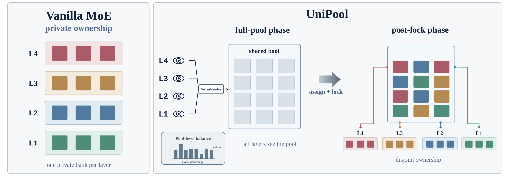

# UniPool

Codebase for the paper [*UniPool: Learning Expert-to-Layer Ownership from
Brief Global Access*](https://arxiv.org/abs/2605.06665) (arXiv:2605.06665).



Most Mixture-of-Experts (MoE) transformers assign each expert to one layer
before training starts, while the experts are still interchangeable. UniPool
instead *learns* the expert-to-layer allocation. During a short full-pool
phase, every layer routes over one globally shared expert pool. UniPool then
gives each expert to exactly one layer, locks this disjoint allocation, and
trains the rest of the run as a layer-private MoE.

This repository is a research fork of NVIDIA Megatron-LM / Megatron Core. The
training and evaluation setup (Pile preprocessing, LLaMA-architecture
backbones) follows the protocol of [ReMoE](https://github.com/thu-ml/ReMoE)
and reuses its data pipeline, so results are directly comparable. The original
upstream Megatron README is preserved as [README_MEGATRON.md](README_MEGATRON.md).

## What is UniPool?

A vanilla MoE layer `l` owns a private bank of `E` experts. UniPool replaces
the `L` private banks with one pool of `M` experts and keeps a separate router
per layer. Layer `l` selects its top-k experts among the experts it can see.

Two components make shared-pool training work:

- **Pool-level auxiliary loss.** This loss balances *aggregate* usage across
  all layers instead of within each layer. An expert that one layer ignores
  can serve another, so layers keep distinct preferences and no expert dies
  globally.
- **NormRouter.** Router logits go through L2 normalization, then ReLU, then a
  learnable scale. Scores do not depend on each layer's logit norm, so layers
  compete for the pool on a common scale.

The paper studies two variants:

- **UniPool-lock (main method).**
  - **Full-pool phase (first 2K steps).** Every layer can use every expert.
    A target-cardinality entropy loss concentrates each layer on about `E`
    experts, while the pool loss keeps different layers on different experts.
  - **Assign.** At step 1K, a small assignment problem gives every expert
    exactly one owner layer from validation routing statistics.
  - **Anneal.** Off-allocation scores are faded out with a cosine ramp over
    steps 1K–2K.
  - **Lock.** The allocation is locked at step 2K.
  - **After the lock**, each layer routes over its own `E` experts only.
    Expert parameters and routed FLOPs match vanilla MoE, and compact
    dispatch keeps the step time within −0.7% to +2.8% of vanilla MoE.
- **UniPool-full.** Every layer keeps full-pool access for the whole run. It
  is a quality reference and supports the reduced-pool (`M < E·L`) analysis.

Test loss (lower is better) with matched expert-FFN budget and routed expert
FLOPs. Training uses 30B Pile tokens up to 830M and 60B tokens at 1.5B.
**Bold** marks the best loss in each column.

| Method | 182M | 469M | 650M | 830M | 1.5B | 16E/top‑2 | 32E/top‑4 |
|:--|:-:|:-:|:-:|:-:|:-:|:-:|:-:|
| Vanilla MoE | 1.9317 | 1.7982 | 1.7568 | 1.7309 | 1.6320 | 1.8589 | 1.7974 |
| UniPool‑lock | **1.9029** | **1.7615** | 1.7324 | 1.6944 | **1.6073** | 1.8291 | 1.7702 |
| UniPool‑full | **1.9029** | 1.7636 | **1.7260** | **1.6923** | – | **1.8277** | **1.7672** |
| *Δ lock − vanilla* | *−0.0288* | *−0.0367* | *−0.0244* | *−0.0365* | *−0.0247* | *−0.0298* | *−0.0272* |

The five scale columns use 8 experts per layer with top-1 routing. The last
two columns add full-width experts to the 12-layer 182M backbone, giving about
268M (16E/top-2) and 438M (32E/top-4) active parameters. UniPool-full was not
trained at 1.5B.

The paper's controls locate the gain in the learned allocation:

- A random disjoint allocation fixed at initialization, trained with the same
  router and losses, only matches vanilla MoE.
- Locking the allocation learned in the full-pool phase recovers nearly all
  of the persistent full-pool gain.
- UniPool-full also beats vanilla MoE with only 66.7% (182M) to 50% (469M,
  650M) of its expert parameters.

## Installation

UniPool shares the same dependency stack as Megatron-LM/Megatron Core. The
recommended route is an NVIDIA PyTorch/NGC container with PyTorch, CUDA,
NCCL, Transformer Engine, and Triton installed; see
[README_MEGATRON.md](README_MEGATRON.md) for the full upstream notes.

From the repository root:

```bash
pip install --no-build-isolation -e ".[mlm,dev]"
pip install "scipy>=1.9"   # allocation solver used by UniPool-lock
```

The distribution package name is `unipool-megatron`. The Python import path
remains `megatron` because this is a Megatron fork.

## Usage

The shared-pool surface is enabled with these flags (see
`scripts/train_llama_*_moe_UniPool.sh` for full UniPool-full configurations):

- `--moe-expert-pool-mode hyper` — each MoE layer gets its own router while
  sharing a global or grouped expert pool.
- `--moe-expert-pool-size <N>` — group size. Empty means one global pool
  across all layers; positive `N` groups every `N` adjacent layers into one
  pool.
- `--moe-pool-aux-loss-coeff <coeff>` — pool-level load balancing across all
  layers that share a pool.
- `--moe-norm-routing` — NormRouter (default in UniPool scripts).

UniPool-lock adds `--moe-progressive-curriculum` on top of a global pool; see
the next section.

Core implementation lives in `megatron/core/transformer/moe/{moe_layer,
moe_utils,router}.py` and `megatron/training/{arguments,checkpointing}.py`.

## UniPool-lock: Ownership Learning and Lock

UniPool-lock trains a global pool of `M = K * L` experts and then hands every
layer its own `K` experts (`K = E`, the vanilla per-layer count). The
per-layer expert sets are chosen from where the routers actually send tokens
during the full-pool phase.

The run has three phases. The boundaries are fractions of `--train-iters`;
the iterations below are for the default 60k-iteration recipe.

1. **Full-pool phase (iterations 0–1000).** The run is plain UniPool.
   - A target-cardinality entropy loss is added:
     `coeff * (H_l - log K_tar)^2 / L`, with `K_tar = K = 8` and `coeff = 5e-3`.
   - `H_l` is the entropy of layer `l`'s population-level routing distribution.
   - The coefficient warms up linearly over the first 1000 iterations.
2. **Candidate freeze (validation at 1000).**
   - Routing counts are EMA-smoothed over the last validations.
   - An exact MILP partitions the pool: every layer gets exactly
     `K = num_experts / num_layers` experts, and every expert gets exactly one
     owner.
   - The MILP targets 95% routed-token coverage per layer. When that is
     infeasible, it locks the best-coverage partition and logs the per-layer
     deficits.
3. **Anneal and lock (iterations 1000–2000).**
   - Router scores of experts outside each layer's partition are faded out
     with a cosine ramp.
   - At iteration 2000 the partition is installed as a hard mask for the rest
     of training.
   - Locked-out logits stay inside NormRouter's L2 norm, so the end of the ramp
     and the locked forward compute the same scores.

Throughout the run, a fail-stop halts training if the validation loss exceeds
the value measured at the candidate freeze by more than 0.05 on two
consecutive validations.

```bash
bash scripts/train_llama_182m_moe_UniPool_curriculum.sh   # 12 layers, 96 experts, K = 8
bash scripts/train_llama_469m_moe_UniPool_curriculum.sh   # 24 layers, 192 experts, K = 8
#   [gpus_per_node] [train_iters] [micro_batch_size] [project_name]
#   env: SEED, POOL_AUX, SAVE_INTERVAL, SAVE_RETAIN_INTERVAL, EVAL_INTERVAL, EVAL_ITERS
```

Flags:

- `--moe-progressive-curriculum` enables UniPool-lock.
  - It requires `--moe-expert-pool-mode hyper` with one global pool and
    `--moe-norm-routing`.
  - It requires `--moe-pool-aux-loss-coeff > 0` and `--moe-aux-loss-coeff 0`.
  - It requires `num_experts` to be a multiple of `num_layers`, and
    PP = EP = 1.
- `--moe-progressive-{lock,anneal,entropy-warmup}-fraction` set the schedule.
  `--eval-interval` must divide both the freeze and the lock iteration.
- `--moe-progressive-entropy-{coeff,target}` set the entropy loss.
- `--moe-progressive-final-coverage-threshold` sets the MILP coverage target.
- `--moe-progressive-max-val-loss-excess` and
  `--moe-progressive-loss-excess-consecutive` set the fail-stop.
- `--moe-progressive-ema-{lookback,alpha}` set the routing-count smoothing.
- Three runtime paths make the post-lock step as cheap as the equivalent
  vanilla layer without changing numerics. The launchers enable all three.
  - `--moe-progressive-compact-dispatch` runs dispatch and grouped GEMM over
    the `K` visible experts. It requires the TE grouped-GEMM alltoall path with
    TP = 1.
  - `--moe-progressive-compact-router` runs the NormRouter tail after the L2
    norm on the `K` visible columns.
  - `--moe-progressive-overlap-grad-reduce` makes `--overlap-grad-reduce` safe
    by declaring the per-step gradient-hook firing count of every pool expert
    at each mask install.

The partition solver needs SciPy ≥ 1.9, which is checked at launch.

The curriculum state is embedded in every checkpoint. It holds the partition,
the anneal window and the smoothed routing history. Resuming restores it
exactly. Resuming past iteration 0 from a checkpoint without that state is
refused.

The following curriculum metrics are logged at every validation under
`curriculum/progressive/*`:

- per-layer K and routed-token coverage;
- natural and effective candidate coverage;
- routes outside the hard mask, which must be 0 after the lock;
- effective routed cardinality.

The implementation lives in
`megatron/core/transformer/moe/{progressive_curriculum,curriculum}.py`. CPU
tests are in `tests/unit_tests/transformer/moe/test_progressive_curriculum.py`
(run with `pytest --noconftest`).

## Reproducing the Results

1. **Data preprocessing.** Download the Pile from
   [`monology/pile-uncopyrighted`](https://huggingface.co/datasets/monology/pile-uncopyrighted)
   and place shards at `../pile/{00..29}.jsonl`, then run:

   ```bash
   bash data_preprocessing.sh
   ```

   This writes Megatron indexed datasets to `../pile_gpt_test/`. The data
   pipeline matches ReMoE's. Override paths via `INPUT_DIR`, `OUTPUT_DIR`,
   `VOCAB_FILE`, `MERGE_FILE` env vars if your layout differs.

2. **Training.** UniPool shared-pool runs:

   ```bash
   # UniPool-full (persistent full-pool access)
   bash scripts/train_llama_<size>_moe_UniPool.sh
   #   size in {182m, 469m, 650m, 830m, 978m}
   # UniPool-lock (ownership learning + lock; see the section above)
   bash scripts/train_llama_<size>_moe_UniPool_curriculum.sh
   #   size in {182m, 469m}
   ```

   Full script signature:

   ```text
   bash scripts/train_llama_<size>_moe_UniPool.sh \
     [gpus_per_node] [train_iters] [micro_batch_size] [num_experts] \
     [norm_routing] [layer_aux_coeff] [pool_aux_coeff] [pool_size] \
     [project_name] [save_interval] [save_retain_interval] [num_layers] [top_k]
   ```

   For 650m / 830m, additional `EP_SIZE` (expert model parallel) and
   `EXIT_DURATION_MIN` (wall-clock save+exit) env vars are available in the
   script headers. Defaults: sequence length 1024, global batch size 512,
   60k iters ≈ 30B tokens.

   Dense and vanilla-MoE baselines under matched configs are also provided
   as `scripts/train_llama_<size>_{dense,moe}.sh`. Outputs land in
   `new_logs/<project_name>` (UniPool / MoE) and `logs/<project_name>`
   (dense). Checkpoints are passed to both `--save` and `--load` so training
   can resume from the same directory.

## Acknowledgments

UniPool builds on top of
[NVIDIA Megatron-LM](https://github.com/NVIDIA/Megatron-LM) and adopts the
experimental setup (data pipeline, LLaMA-architecture baselines, evaluation
protocol) from [ReMoE](https://github.com/thu-ml/ReMoE) by Wang, Chen, and
Zhu (arXiv:2412.14711). Upstream notices are retained in source files and
summarized in [NOTICE](NOTICE).

## Citation

If you use UniPool, please cite:

```bibtex
@article{huang2026unipool,
  title={UniPool: Learning Expert-to-Layer Ownership from Brief Global Access},
  author={Huang, Minbin and Shi, Han and Zheng, Chuanyang and Wu, Yimeng
          and Chen, Guoxuan and Yu, Xingtong and Yin, Yichun and Cheng, Hong},
  journal={arXiv preprint arXiv:2605.06665},
  year={2026}
}
```

## License

UniPool modifications are released under the license terms in
[LICENSE](LICENSE). This repository includes derivative work from
Megatron-LM and other upstream projects.
